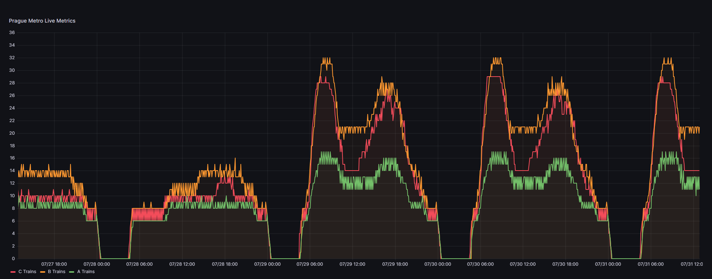

# Prague PID data processing

## Description
This project is a small JavaScript script that fetches real-time information about vehicles in Prague.
PID (Pražská Integrovaná Doprava) has made a beautiful [live map](https://mapa.pid.cz) of all the transportation vehicles using their API.
Using this API, this script is able to pull the data.

## Notice
I am not affiliated with PID in any way, and I am not responsible for any misuse of their API!

Warning! The `INTERVAL_MINUTES` variable in the .env file is the time in minutes between each fetch.
Please use PID’s API responsibly and do not overload their servers.

I was unable to find any information whether one can use the API for personal use and grab the data externally.
The API does not have any kind of authentication or rate limiting by my knowledge. If the PID wishes me to take down this repository, please contact me at [my email](mailto:tomset111@gmail.com).
I am absolute willing to cooperate, and I will respect the decision. Thank you.

## Supported vehicles
- [X] Metro
- [ ] Tram
- [ ] Buses
- [ ] Trains
- [ ] Ferries
- [ ] Trolleybuses

* Support for more vehicles might be added in the future.

## Installation
1. Clone the repository
2. Run `npm install`
3. Fill the `.env` file
4. Run `node index.js`

## Requirements
It is required to have a MySQL table created with the following structure in order to store the data.
```sql
create table metro
(
    id int auto_increment primary key,
    fetch_datetime datetime default CURRENT_TIMESTAMP null,
    c_trains int not null,
    b_trains int not null,
    a_trains int not null
);
```

## What can I do with this?
Well, you can use external tools such as [Grafana](https://grafana.com/) to visualize the data.
Based off the visualisation, you will be able to see the peak times and times of no operation.
If any incidents will happen, you will be able to see the impact on the transportation system.

## Example
Here is an example of the data visualized in Grafana.

